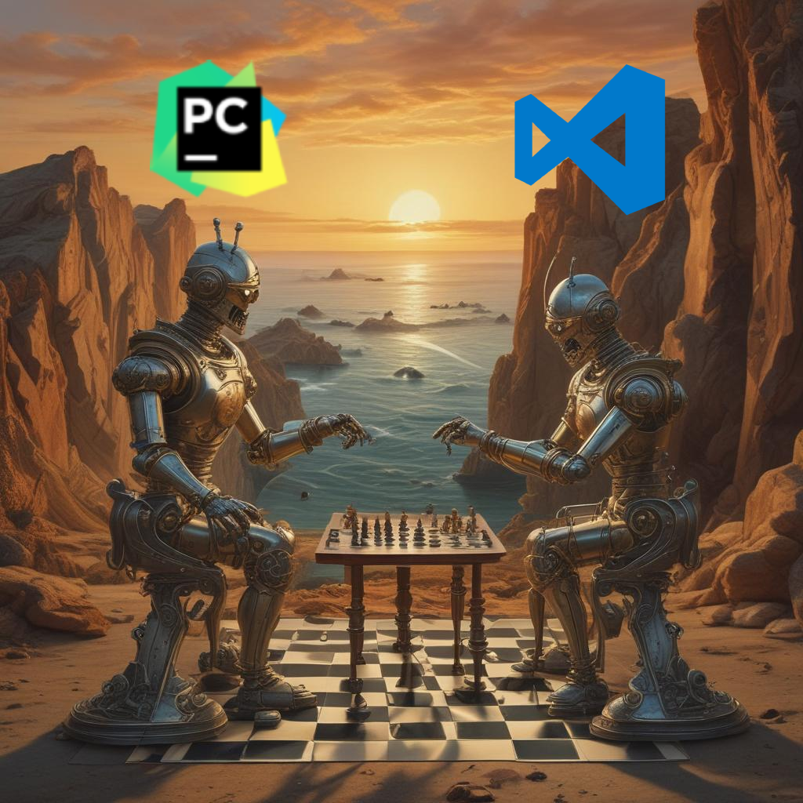

    
    <h1 align="center">VS Code vs PyCharm</h1>
    <h3 align="center">CrewAI settles the debate once and for all!</h3>

---

What better than solving the **eternal debate between VS Code and PyCharm** using CrewAI?

To achieve this goal, I've created three [agents](agents.py):

Ok, so to reframe this debate into CrewAI I decided to create 𝘁𝗵𝗿𝗲𝗲 𝗮𝗴𝗲𝗻𝘁𝘀:

1️⃣ 𝗣𝘆𝗰𝗵𝗮𝗿𝗺 𝗮𝗴𝗲𝗻𝘁: Basically a PyCharm developer who hates VSCode with all his heart and will look for as much information as possible about the advantages of PyCharm over VSCode.

2️⃣ 𝗩𝗦 𝗖𝗼𝗱𝗲 𝗔𝗴𝗲𝗻𝘁: A VS Code developer who hates PyCharm's slowness and memory consumption. He is always looking for excuses to prove that VSCode is much better than PyCharm.

3️⃣ 𝗜𝗗𝗘 𝗝𝘂𝗱𝗴𝗲 𝗔𝗴𝗲𝗻𝘁: A veteran developer in the position to judge, in view of the data presented by the two previous agents, on which framework is better.

In addition, I used a custom tool that basically wraps the Exa search engine.

𝗔𝘁 𝘁𝗵𝗶𝘀 𝗽𝗼𝗶𝗻𝘁 𝘆𝗼𝘂 𝗺𝗮𝘆 𝗯𝗲 𝘄𝗼𝗻𝗱𝗲𝗿𝗶𝗻𝗴: 𝘄𝗵𝗮𝘁'𝘀 𝘁𝗵𝗲 𝗳𝗶𝗻𝗮𝗹 𝘃𝗲𝗿𝗱𝗶𝗰𝘁? 

Well ... try it out!! 